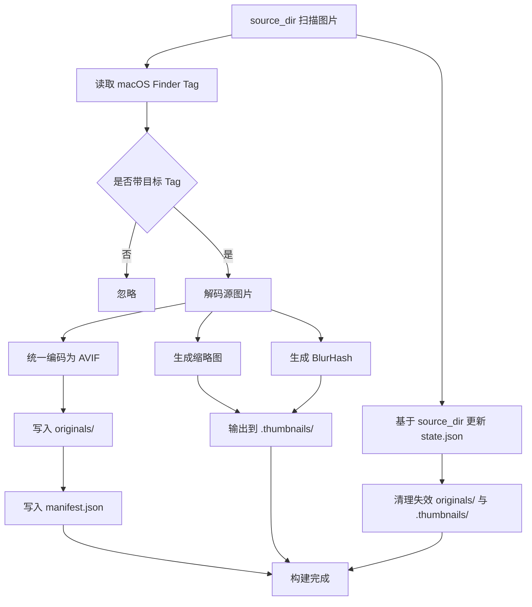

# 图片处理程序架构

## 流程图

## 技术栈

### 图片处理程序

- 语言：Rust
- CLI：`clap`
- 并行处理：`rayon`
- 目录遍历：`walkdir`
- Finder Tag 读取：`xattr` + `plist`
- 通用图像解码：`image`
- HEIF/HIF 解码：`libheif-rs`
- AVIF 编码：`image::codecs::avif::AvifEncoder`
- 高性能缩放：`fast_image_resize`
- 缩略图编码：`webp`
- BlurHash：`blurhash`
- JSON 序列化：`serde` + `serde_json`
- 日志：`tracing` + `tracing-subscriber`
- 增量索引：`state.json`

### 存储与同步

- 对象存储：Cloudflare R2
- 文件同步：外部 `rclone` 脚本
- CDN：Cloudflare CDN
