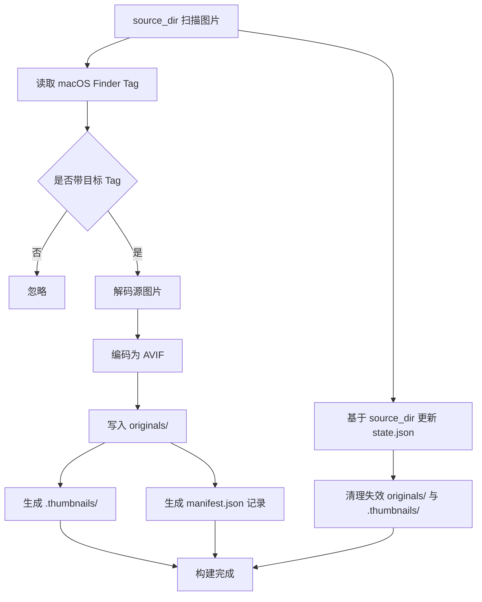

# 技术架构调整

本次调整的核心目标是把“拍摄素材目录”和“对外发布目录”分离。

- `source_dir`：真实素材目录，只读，不参与同步
- `originals_dir`：发布原图目录，位于工作目录下，会参与同步
- `.thumbnails/`、`manifest.json`、`state.json`：仍然位于工作目录下

## 调整后的目录角色

```txt
source_dir/
    20240209-Paris/
    20241229-Roma/

path/
    originals/
    .thumbnails/
    manifest.json
    state.json
```

- `source_dir` 中一个文件夹仍然代表一个相簿
- `path` 是工作目录，也是最终产物目录
- `originals/` 中保存的是统一格式后的“可发布版本原图”，不是拍摄素材本身

## 核心规则

### 1. 以 `source_dir` 为输入源

构建时不再扫描工作目录下的 `originals/`，而是扫描配置中的 `source_dir`。

### 2. 只处理带指定 macOS Tag 的图片

当前仅支持 macOS。

- 在 `source_dir` 中遍历图片文件
- 只筛选带指定 Finder Tag 的文件
- 未打 Tag 的图片直接忽略

这意味着“是否参与构建”由 `source_dir + Tag` 决定，而不是由 `originals_dir` 决定。

### 3. 所有入选图片统一转换为 AVIF

对于被选中的图片：

- 无论源文件是 `HIF / HEIF / HEIC`、`JPEG`、`PNG` 还是其他支持格式，统一转换为 `AVIF`
- 转换后的文件写入 `originals_dir`
- 输出时保留原有相簿目录结构

示例：

```txt
source_dir/20241229-Roma/DSC03872.HIF
    -> path/originals/20241229-Roma/DSC03872.avif

source_dir/20241229-Roma/DSC03873.JPG
    -> path/originals/20241229-Roma/DSC03873.avif
```

### 4. 缩略图和 JSON 仍然在工作目录下生成

对于每一张被选中的源图片，同时生成：

- `originals/...` 下的 `AVIF` 发布原图
- `.thumbnails/...` 下的缩略图
- `manifest.json` 中的图片记录
- `state.json` 中的增量状态记录

其中：

- `manifest.json` 面向下游消费，记录发布后的原图路径和缩略图路径
- `state.json` 面向增量构建，判断依据必须来自 `source_dir` 中被打 Tag 的源文件

### 5. 增量构建基准以源文件为准

`state.json` 的判断对象不再是 `originals_dir` 中的文件，而是 `source_dir` 中满足 Tag 条件的源文件。

以下任一情况发生时，需要重新处理该文件：

- 源文件新增
- 源文件 `size` 或 `mtime` 变化
- 对应发布原图不存在
- 对应缩略图不存在
- 文件原本有 Tag，后来被移除
- 文件被移动或删除

以下情况应视为失效产物并清理：

- `source_dir` 中源文件已不存在
- 源文件不再带目标 Tag

## 调整后的构建流程



## 配置调整

配置需要增加独立的素材目录和 Tag 筛选规则。

建议配置如下：

```toml
sourcePath = "/Volumes/Xin T7/Photos"
targetPath = "/Volumes/Xin T7/R2"
originals_dir = "gallery"
thumbnails_dir = "thumbnails"
thumbnail_width = 640
thumbnail_format = "webp"
thumbnail_quality = 82
enable_blurhash = true
```

如需按 Finder Tag 过滤，可额外设置：

```toml
sourceTag = "Aether"
```

字段含义：

- `targetPath`：工作目录，存放 `originals/`、`.thumbnails/`、`manifest.json`、`state.json`
- `sourcePath`：拍摄素材目录，只读
- `sourceTag`：可选的 macOS Finder Tag，仅处理带该 Tag 的图片
- `originals_dir`：发布原图目录

## 数据口径调整

### manifest.json

- `original.url` 指向工作目录下的 `originals/...`
- 所有入选图片在这里都记录为转码后的 `AVIF`
- 原始素材格式不再暴露给下游消费层

### state.json

- 以 `source_dir` 中的源文件为主键或判断依据
- 记录源文件的 `size`、`mtimeMs`
- 同时记录产出的 `originals/...` 和 `.thumbnails/...` 路径

也就是说：

- `manifest.json` 描述“发布结果”
- `state.json` 描述“源文件到发布结果的映射关系”

## 技术栈调整

- 目录遍历：`walkdir`
- macOS Tag 读取：`xattr` + `plist`
- 通用图像解码：`image`
- HEIF/HIF 解码：`libheif-rs`
- AVIF 编码：`image::codecs::avif::AvifEncoder`
- 缩略图缩放：`fast_image_resize`
- 缩略图编码：`webp`
- BlurHash：`blurhash`
- 数据序列化：`serde` + `serde_json`

## 命令边界

命令仍然只保留一个：

```bash
aether build
```

但它的内部职责变为：

1. 扫描 `source_dir`
2. 按 `source_tag` 过滤
3. 将入选图片统一转为 `AVIF` 并写入 `originals/`
4. 生成缩略图到 `.thumbnails/`
5. 更新 `manifest.json`
6. 更新 `state.json`
7. 清理失效产物

## 结论

调整后的架构更适合当前使用方式：

- 拍摄素材和发布目录彻底分离
- 是否处理由 macOS Tag 控制
- 所有发布原图统一为 `AVIF`，下游格式稳定
- 增量构建仍然成立，但判断基准明确切换为 `source_dir`
